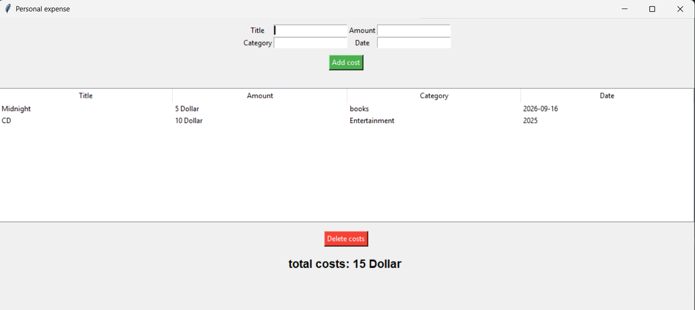

# Personal Expense Tracker

A desktop expense management application developed with Python and Tkinter.

# Screenshot

# Technologies

- Python
- Tkinter
- Treeview

# Features

1 Add expenses
2 Categorize expenses
3 Delete expenses
4 Calculate total expenses
5 User-friendly GUI
